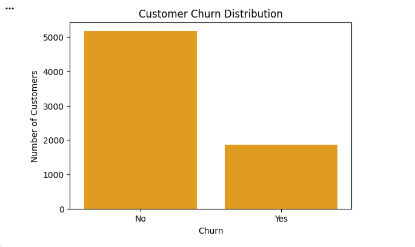
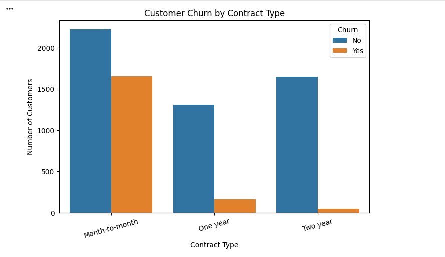
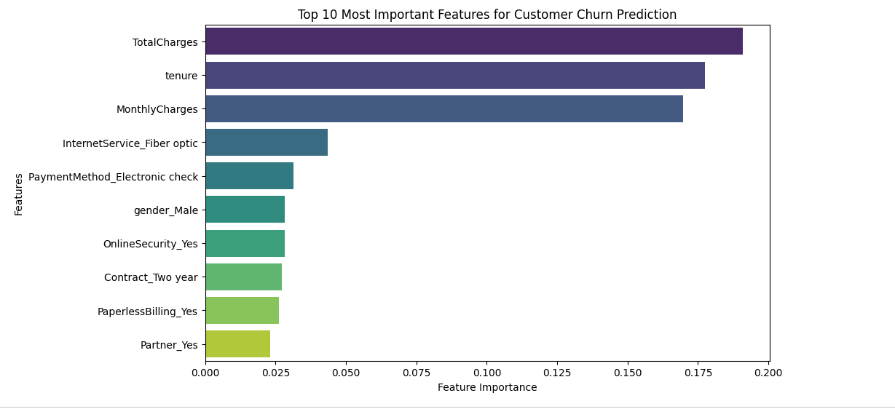
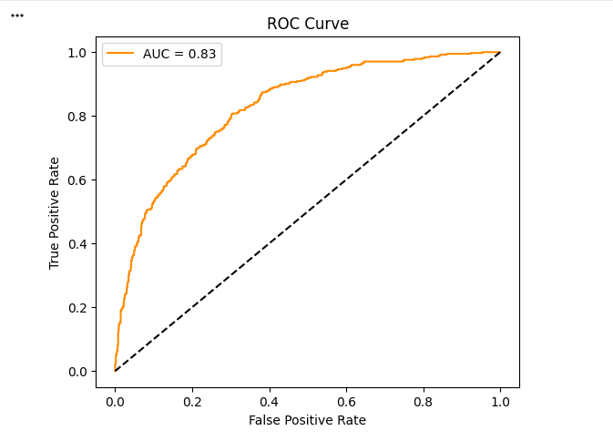

# 📉 Customer Churn Prediction & Retention Analysis

A machine learning project that predicts customer churn using customer demographic, service, and billing information. The project applies data preprocessing, exploratory data analysis (EDA), feature engineering, and multiple classification models to identify customers at risk of leaving and provide actionable business recommendations for improving customer retention.

---

## 📌 Project Overview

Customer churn is one of the biggest challenges for subscription-based businesses because losing existing customers directly impacts revenue and profitability. This project develops a machine learning solution to identify customers who are likely to churn, enabling businesses to take proactive retention measures through data-driven decision making.

---
## 🎯 Business Objectives

- Predict whether a customer is likely to churn.
- Identify the key factors influencing customer churn.
- Compare multiple machine learning classification algorithms.
- Select the best-performing model.
- Provide actionable business recommendations to improve customer retention.

---
## 📂 Dataset

The dataset contains customer information from a telecom company, including:

- Customer demographics
- Account information
- Internet services
- Contract type
- Payment method
- Monthly charges
- Total charges
- Customer tenure

**Target Variable**

- **Churn**
  - Yes
  - No

---
## 🛠️ Technologies Used

| Category | Tools |
|----------|-------|
| Programming Language | Python |
| Data Analysis | Pandas, NumPy |
| Data Visualization | Matplotlib, Seaborn |
| Machine Learning | Scikit-learn |
| Development Environment | Google Colab / Jupyter Notebook |

---

## 📊 Project Workflow

This project follows a structured machine learning workflow:

1. Data Loading
2. Data Cleaning & Preprocessing
3. Exploratory Data Analysis (EDA)
4. Feature Engineering
5. Train-Test Split
6. Feature Scaling
7. Model Development
8. Model Evaluation
9. Feature Importance Analysis
10. Business Recommendations

---
---

# 📷 Project Screenshots

### 📊 Customer Churn Distribution


Shows the imbalance between customers who stayed and those who churned.

---

### 📈 Customer Churn by Contract Type


Customers with month-to-month contracts exhibit the highest churn rate.

---

### ⭐ Feature Importance


The model identifies Contract Type, Tenure, Monthly Charges, Total Charges, and Internet Service as the most influential predictors.

---

### 📉 ROC Curve


The Logistic Regression model achieved an ROC-AUC score of **0.83**, indicating good discrimination between churn and non-churn customers.

> Additional visualizations and detailed analysis are available in the Jupyter Notebook.
---

# 📊 Model Performance

Three machine learning classification algorithms were trained and evaluated using multiple performance metrics.

| Model | Accuracy | Precision | Recall | F1-Score |
|--------|---------:|----------:|-------:|---------:|
| Logistic Regression | **80.27%** | **66.00%** | **52.94%** | **58.75%** |
| Decision Tree | 78.50% | 65.78% | 39.57% | 49.42% |
| Random Forest | 79.21% | 64.31% | 48.66% | 55.40% |

**Best Performing Model:** Logistic Regression

**ROC-AUC Score:** **0.83**

---
# 🔍 Key Insights

The exploratory data analysis identified several important factors associated with customer churn:

- Customers with **month-to-month contracts** exhibited the highest churn rate.
- **Fiber Optic** internet users were more likely to churn than DSL users.
- Customers using **Electronic Check** as their payment method showed higher churn.
- Customers with **shorter tenure** were significantly more likely to leave.
- Higher **Monthly Charges** were associated with an increased risk of churn.

These findings highlight customer segments that businesses can prioritize for retention initiatives.

---
# 💼 Business Recommendations

Based on the analysis, the following strategies can help reduce customer churn:

- Encourage customers to switch from month-to-month to long-term contracts.
- Improve customer experience for Fiber Optic internet services.
- Promote automatic payment methods to reduce churn risk.
- Design targeted retention campaigns for new customers with shorter tenure.
- Monitor customers with high monthly charges and provide personalized offers.
- Develop loyalty programs for high-risk customer segments.

---

---

# 📁 Repository Structure

```text
Customer-Churn-Prediction/
│
├── data/
│   └── customer_churn.csv
│
├── images/
│   ├── churn_distribution.png
│   ├── churn_vs_contract.png
│   ├── feature_importance.png
│   └── roc_curve.png
│
├── Customer_Churn_Prediction.ipynb
├── requirements.txt
├── README.md
├── LICENSE
└── .gitignore
```

---

# ▶️ How to Run

### 1. Clone the repository

```bash
git clone https://github.com/sudhirintel/Customer-Churn-Prediction.git
```

### 2. Install dependencies

```bash
pip install - requirements.txt
```

### 3. Open the notebook

Run the `Customer_Churn_Prediction.ipynb` notebook in **Google Colab** or **Jupyter Notebook**.

### 4. Execute all cells

Run all notebook cells sequentially to reproduce the analysis and machine learning results.

---
# 🚀 Future Improvements

Future enhancements for this project include:

- Hyperparameter tuning using GridSearchCV.
- Cross-validation for more robust model evaluation.
- Implementation of XGBoost and LightGBM models.
- Model explainability using SHAP values.
- Deployment as an interactive web application using Streamlit.
- Development of a real-time customer churn prediction system.

 ---
# 👨‍💻 Author

**Sudhir Satapathy**

MBA (Finance & Marketing)

Aspiring Data Analyst

### Skills

- Python
- SQL
- Power BI
- Excel
- Machine Learning

⭐ If you found this project useful, consider starring this repository.
